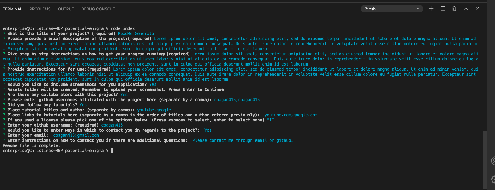

# README-Generator

## Description

This application generates a ReadMe file for GitHub.

This was done by using Node Inquirer through prompts. 
Once Initiated through the command line, the user will have to follow the directions in order to generate a ReadMe file. 

## Usage

View link to video here: https://drive.google.com/file/d/1UjUIUOLMvHVYwRJpJqEtcq8p6_zCdauw/preview

GitHub Repo: https://github.com/cpagan415/README-Generator

Sample image from the command line:

